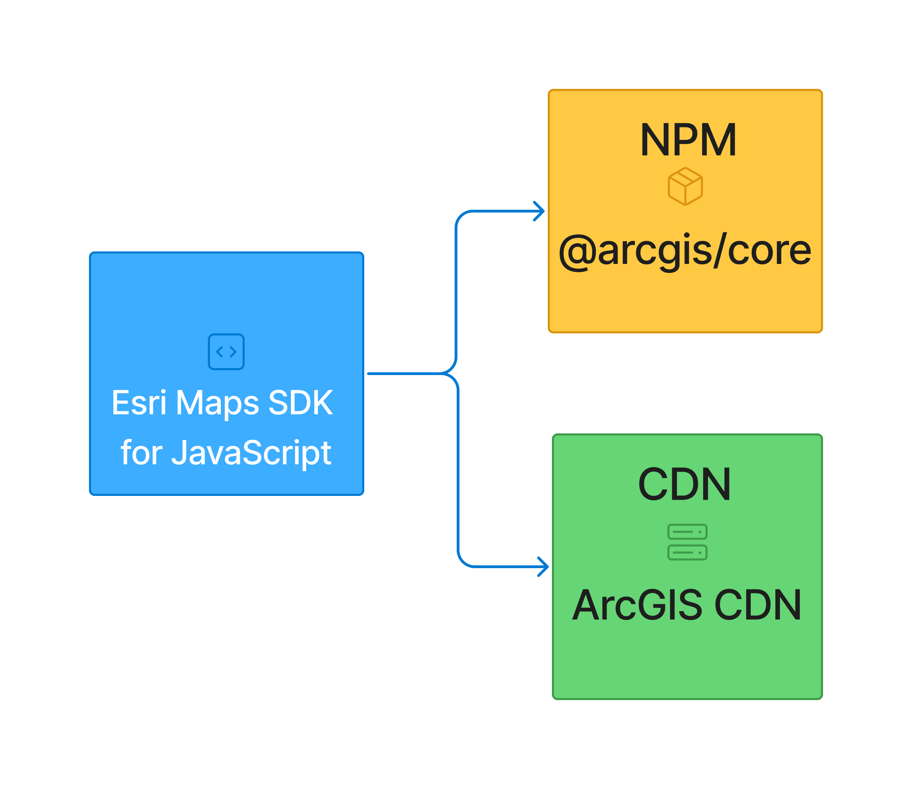
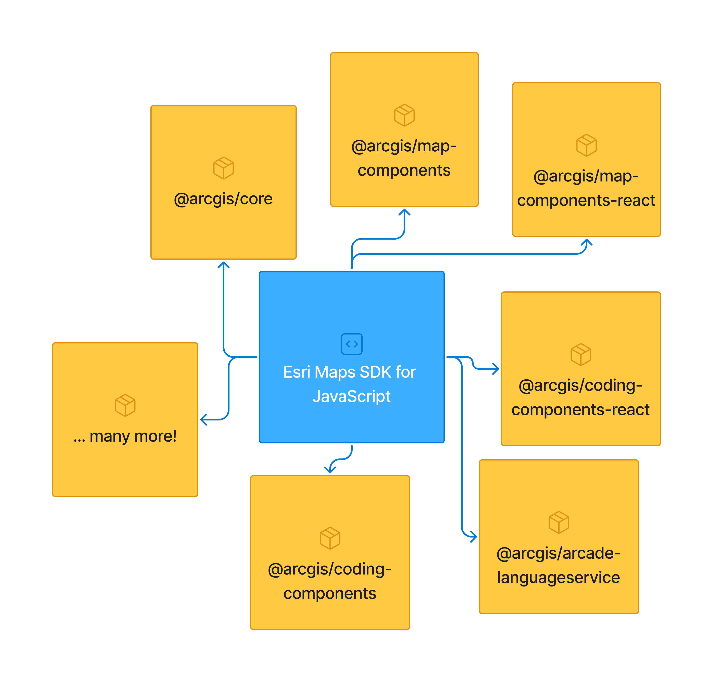
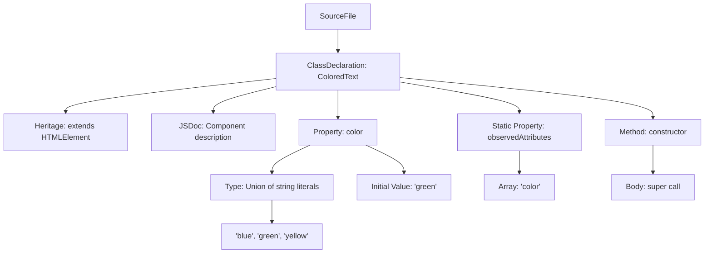
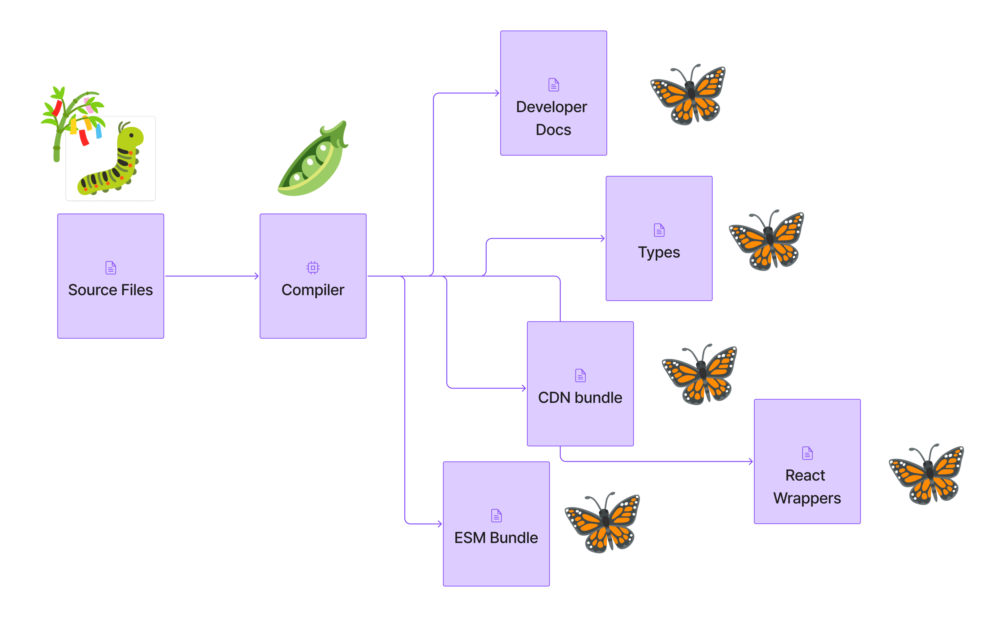

# Code <br/> Metamorphosis:
### How Our SDK Transforms <br/> Through Multiple Compilation Stages

---

# Background


- Brief overview of the Maps SDK's evolution to include declarative UX components
- The challenge: Distributing these components to varied teams with different tech stacks throughout the organization

---

<div class="container mx-auto px-12">
<div class="grid grid-cols-2 gap-4">
  <div class="bg-gray-500/50 p-4 rounded-lg">
    <h2 class="text-2xl font-bold">Before</h2>
    <p class="text-lg">A single monolithic library</p>
    </img>
  </div>
  <div>
  <div class="bg-gray-500/50 p-4 rounded-lg">
    <h2 class="text-2xl font-bold">After</h2>
    <p class="text-lg">A collection of packages</p>
    </img>
  </div>
  </div>
</div>
</div>

---

# The Challenge

- Enforce consistency across multiple teams
- Provide documentation and types for developers
- Distribute components to teams with different tech stacks
- Ensure components are optimized for performance and usability

---

<div class="container mx-auto px-24 bg-white rounded">
  </img>
</div>

---

# Compilers to the rescue

- We use many different compilers to:
  - Analyze our code while we write it
  - transform our source code into multiple outputs
  - Generate packages, documentation, types, and other metadata
<div class="grid grid-cols-1 md:grid-cols-3 gap-2 mt-8">
  <div class="bg-gray-200 p-2 rounded-lg shadow-md" v-click>
    <h2 class="text-lg font-bold mb-2 text-black">Analyze</h2>
    <div class="grid grid-cols-2 gap-1">
      <div class="bg-gray-100 p-2 rounded-lg shadow-sm h-full flex items-center justify-center">
        <p class="text-center text-black">TypeScript</p>
      </div>
      <div class="bg-gray-100 p-2 rounded-lg shadow-sm mb-2 h-full flex items-center justify-center">
        <p class="text-center text-black">ESLint</p>
      </div>
      <div class="bg-gray-100 p-2 rounded-lg shadow-sm h-full flex items-center justify-center">
        <p class="text-center text-black">Prettier</p>
      </div>
    </div>
  </div>
  <div class="bg-gray-200 p-2 rounded-lg shadow-md" v-click>
    <h2 class="text-lg font-bold mb-2 text-black">Transform</h2>
    <div class="grid grid-cols-2 gap-1">
      <div class="bg-gray-100 p-2 rounded-lg shadow-sm mb-2 h-full flex items-center justify-center">
        <p class="text-center text-black">TypeScript</p>
      </div>
      <div class="bg-gray-100 p-2 rounded-lg shadow-sm mb-2 h-full flex items-center justify-center">
        <p class="text-center text-black">React</p>
      </div>
      <div class="bg-gray-100 p-2 rounded-lg shadow-sm h-full flex items-center justify-center">
        <p class="text-center text-black">Babel</p>
      </div>
      <div class="bg-gray-100 p-2 rounded-lg shadow-sm h-full flex items-center justify-center">
        <p class="text-center text-black">Angular</p>
      </div>
    </div>
  </div>
  <div class="bg-gray-200 p-2 rounded-lg shadow-md" v-click>
    <h2 class="text-lg font-bold mb-2 text-black">Bundle</h2>
    <div class="grid grid-cols-2 gap-1">
      <div class="bg-gray-100 p-2 rounded-lg shadow-sm mb-2 h-full flex items-center justify-center">
        <p class="text-center text-black">Webpack</p>
      </div>
      <div class="bg-gray-100 p-2 rounded-lg shadow-sm mb-2 h-full flex items-center justify-center">
        <p class="text-center text-black">Rollup</p>
      </div>
      <div class="bg-gray-100 p-2 rounded-lg shadow-sm mb-2 h-full flex items-center justify-center">
        <p class="text-center text-black">Parcel</p>
      </div>
      <div class="bg-gray-100 p-2 rounded-lg shadow-sm h-full flex items-center justify-center">
        <p class="text-center text-black">ESBuild</p>
      </div>
    </div>
  </div>
</div>

---

# Our Web Component Compilation Pipeline

<div class="font-mono grid grid-cols-3 gap-4">
  <div class="bg-gray-200/75 transparent px-3 rounded py-2 w-full" v-click>
    <h4 class="text-black">Parse</h4>
    <p class="mt-4 text-md text-black">Parse the source code into an abstract syntax tree</p>
  </div>
  <div class="bg-gray-200/75 px-3 py-2 rounded w-full" v-click>
    <h4 class="text-black">Transform</h4>
    <p class="mt-4 text-md text-black">Apply various transformations to the AST, such as:</p>
    <ul class="list-disc list-inside mt-4 text-sm text-black">
      <li>Optimizing code for performance</li>
      <li>Removing unused code</li>
      <li>Adding metadata for documentation</li>
      <li>Minifying code to reduce file size</li>
      <li>Adding polyfills for older browsers</li>
    </ul>
  </div>
  <div class="bg-gray-200/75 rounded px-3 py-2 w-full" v-click>
    <h4 class="text-black">Generate</h4>
    <p class="mt-4 text-md text-black">Generate the outputs as JavaScript, JSON, or markdown</p>
  </div>
</div>

---

# Visual Example

- Let's take a look at how code is transformed through multiple compilation stages

  1. Start with typescript code for a simple web component
  2. Transform into Javascript with TS compiler
  3. Transform into optimized JS with ESBuild

---

# Code Metamorphosis

<style>
  .slidev-code-wrapper {
    overflow: scroll;
    max-height: 400px;
    border-radius: 8px;
    white-space: pre-wrap !important;
  }
  .slidev-code-wrapper .shiki-magic-move-container {
      position: relative;
      white-space: pre-wrap;
  }
  </style>

````md magic-move
```ts

// TYPESCRIPT CODE

/**
 * A component that counts the number of words in a paragraph
 *
 * @example <word-count color="green">This is four words</word-count>
 */
class WordCount extends HTMLElement {
  
  
  /**
  * The color of the word count text
  * @example "green"
  */
  color: "blue" | "green" | "yellow" = "green";
  
  static observedAttributes = ["color"];
  
  constructor() {
    // Always call super first in constructor
    super();
  }

  connectedCallback() {
    // count words in element's parent element
    const wcParent = this.parentNode;

    function countWords(node: ParentNode | null){
      const text = node?.textContent ?? "";
      return text.trim().split(/\s+/g).filter(a => a.trim().length > 0).length;
    }

    const count = `Words: ${countWords(wcParent)}`;

    // Create a shadow root
    const shadow = this.attachShadow({mode: 'open'});

    // Create text node and add word count to it
    const text = document.createElement('span');
    text.textContent = count;
    text.style.color = this.color;

    // Append it to the shadow root
    shadow.appendChild(text);

    // Update count when element content changes
    this.parentNode?.addEventListener('input', () => {
      text.textContent = `Words: ${countWords(wcParent)}`;
    });
  }
}

// Define the new element
customElements.define('word-count', WordCount);
```
```js
// JAVASCRIPT CODE (TYPESCRIPT COMPILED)
"use strict";
/**
 * A component that counts the number of words in a paragraph
 *
 * @example <word-count color="green">This is three words</word-count>
 */
class WordCount extends HTMLElement {
    constructor() {
        // Always call super first in constructor
        super();
        /**
        * The color of the word count text
        * @example "green"
        */
        this.color = "green";
    }
    connectedCallback() {
        var _a;
        // count words in element's parent element
        const wcParent = this.parentNode;
        function countWords(node) {
            var _a;
            const text = (_a = node === null || node === void 0 ? void 0 : node.textContent) !== null && _a !== void 0 ? _a : "";
            return text.trim().split(/\s+/g).filter(a => a.trim().length > 0).length;
        }
        const count = `Words: ${countWords(wcParent)}`;
        // Create a shadow root
        const shadow = this.attachShadow({ mode: 'open' });
        // Create text node and add word count to it
        const text = document.createElement('span');
        text.textContent = count;
        text.style.color = this.color;
        // Append it to the shadow root
        shadow.appendChild(text);
        // Update count when element content changes
        (_a = this.parentNode) === null || _a === void 0 ? void 0 : _a.addEventListener('input', () => {
            text.textContent = `Words: ${countWords(wcParent)}`;
        });
    }
}
WordCount.observedAttributes = ["color"];
// Define the new element
customElements.define('word-count', WordCount);

```
```ts
// OPTIMIZED JAVASCRIPT CODE (ESBUILD)
"use strict";class WordCount extends HTMLElement{constructor(){super(),this.color="green"}connectedCallback(){var e;const s=this.parentNode;function r(o){var n;return((n=o?.textContent)!==null&&n!==void 0?n:"").trim().split(/\s+/g).filter(l=>l.trim().length>0).length}const c=`Words: ${r(s)}`,d=this.attachShadow({mode:"open"}),t=document.createElement("span");t.textContent=c,t.style.color=this.color,d.appendChild(t),(e=this.parentNode)===null||e===void 0||e.addEventListener("input",()=>{t.textContent=`Words: ${r(s)}`})}}WordCount.observedAttributes=["color"],customElements.define("word-count",WordCount);
```
````

---

# Abstract Syntax Trees (ASTs)

- ASTs represent the structure of source code in a tree format
- Compilers analyze and transform the code based on this structure
- Code is transformed and the output is generated based on the AST

<br/>
<br/>

> ### An AST is like the Rosetta Stone of code—it transforms human-readable syntax into a structured format that a compiler can understand and work with.

---

# Simple AST Example - Code

```ts
/**
 * A component that colors text from a set of predefined colors
 *
 * @example <colored-text color="green">This is three words</colored-text>
 */
class ColoredText extends HTMLElement {
  
  
  /**
  * The color of the word count text
  * @example "green"
  */
  color: "blue" | "green" | "yellow" = "green";
  
  static observedAttributes = ["color"];
  
  constructor() {
    // Always call super first in constructor
    super();
  }
}
```

--- 

# Simple AST - Tree



---
layout: iframe
url: https://astexplorer.net/#/gist/8157691b1de8410e88b876ed3e1db66a/f97ef14d7ccf610897d48401c193ee6d85ae49f7

---

---

# How we use compilers in the JS Maps SDK

<div class="bg-gray-200 text-black p-6 rounded-lg shadow-md">
  <h2 class="text-2xl font-bold mb-4">Beyond our package bundles, our source code is transformed into multiple outputs:</h2>
  <ul class="list-disc list-inside space-y-2">
    <li class="flex items-center">
      <svg class="w-6 h-6 mr-2 text-blue-500" fill="currentColor" viewBox="0 0 20 20"><path d="M10 2a8 8 0 100 16 8 8 0 000-16zm1 11H9v-2h2v2zm0-4H9V7h2v2z"/></svg>
      Documentation metadata that powers developer site
    </li>
    <li class="flex items-center">
      <svg class="w-6 h-6 mr-2 text-green-500" fill="currentColor" viewBox="0 0 20 20"><path d="M10 2a8 8 0 100 16 8 8 0 000-16zm1 11H9v-2h2v2zm0-4H9V7h2v2z"/></svg>
      Types for multiple libraries and frameworks (React, Preact, Stencil, Vanilla JS)
    </li>
    <li class="flex items-center">
      <svg class="w-6 h-6 mr-2 text-red-500" fill="currentColor" viewBox="0 0 20 20"><path d="M10 2a8 8 0 100 16 8 8 0 000-16zm1 11H9v-2h2v2zm0-4H9V7h2v2z"/></svg>
      Wrapper components for React 18
    </li>
    <li class="flex items-center">
      <svg class="w-6 h-6 mr-2 text-yellow-500" fill="currentColor" viewBox="0 0 20 20"><path d="M10 2a8 8 0 100 16 8 8 0 000-16zm1 11H9v-2h2v2zm0-4H9V7h2v2z"/></svg>
      CDN optimized bundles that allow for lazy loading of components, hybrid imports
    </li>
    <li class="flex items-center">
      <svg class="w-6 h-6 mr-2 text-purple-500" fill="currentColor" viewBox="0 0 20 20"><path d="M10 2a8 8 0 100 16 8 8 0 000-16zm1 11H9v-2h2v2zm0-4H9V7h2v2z"/></svg>
      ESM bundle
    </li>
  </ul>
</div>

---

# Documentation Generation

- We generate documentation metadata directly from our source code
- We use ASTs to extract type annotations and JSDoc comments and output our that data into a standard format
  - https://github.com/webcomponents/custom-elements-manifest
- This metadata is then used to power our developer site

---
layout: iframe

url: https://developers.arcgis.com/javascript/latest/references/map-components/arcgis-expand/#properties
---
---
layout: center
---

# Demo: [Create custom elements manifest from source code](../demos/1.1-docs-gen/)

---

<div class="negative-margin scale-110">
<v-switch>
<template #0></img></template>
<template #1></img></template>
<template #2></img></template>
<template #3></img></template>
<template #4></img></template>
<template #5></img></template>
<template #6></img></template>
<template #7></img></template>
<template #8></img></template>
<template #9></img></template>
<template #10></img></template>
</v-switch>
</div>

--- 

# Documentation from source code - Benefits

- Ensures that documentation is always up-to-date
- Reduces the need for manual documentation
- Provides a consistent format for documentation across components and packages
- Allows for easy integration with other tools and services

---


---

# Summary

<div class="container mx-auto px-24 bg-white rounded">
  </img>
</div>

---

# Conclusion

- Compilers are essential for modern web development
- They allow us to transform our source code into multiple outputs
- They enable us to distribute components to teams with different tech stacks
- They help us enforce consistency and provide documentation and types for developers

<!-- 
In closing, I'm not saying you need to go out there and start cracking open asts on the daily. But I do think it's important to understand the tools and processes that are at play when you're working with modern web development.
-->


<br/><br/><br/><br/>
> ## Modern web development isn't just writing code - it's shepherding that code through multiple transformation stages
