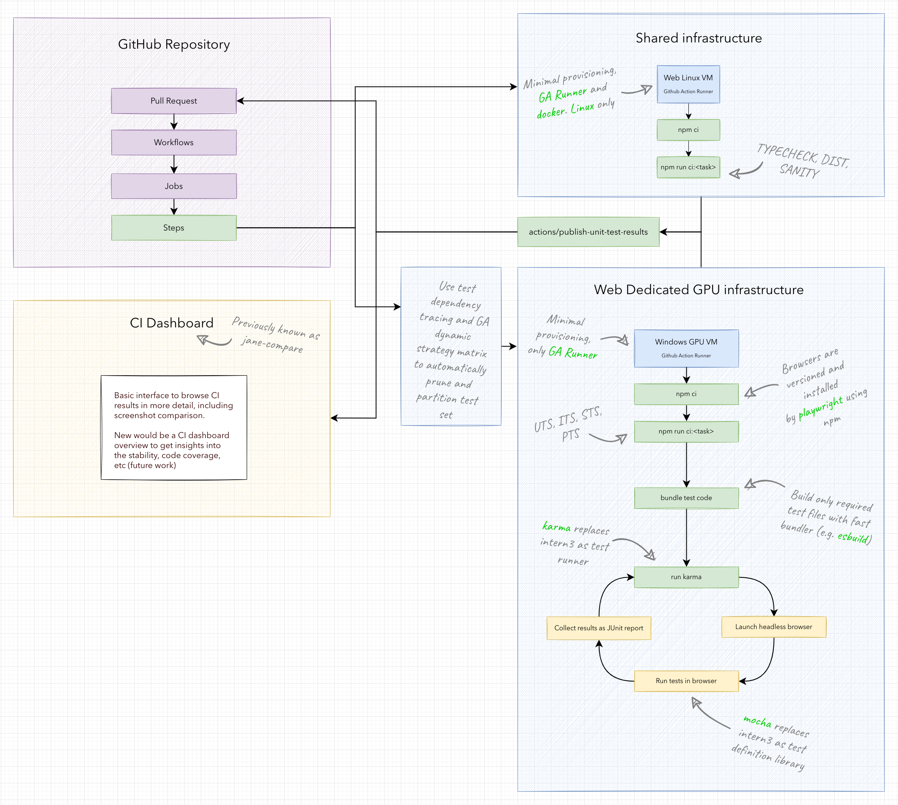
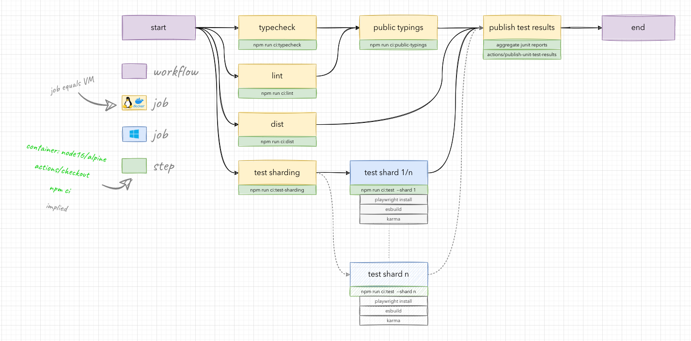
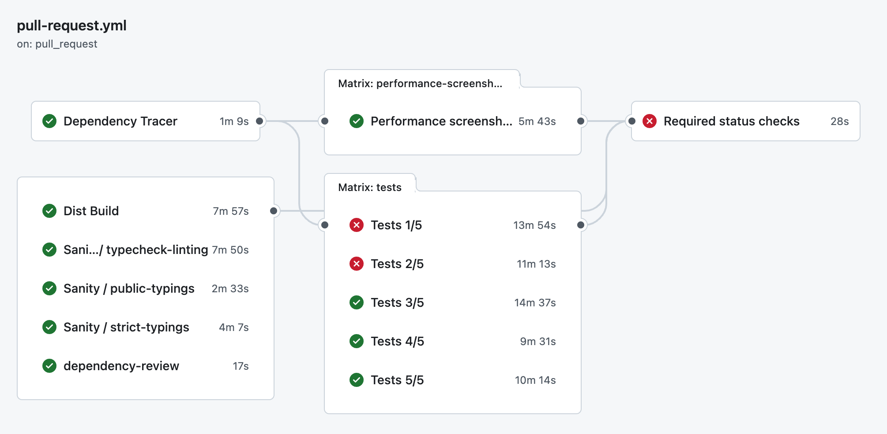
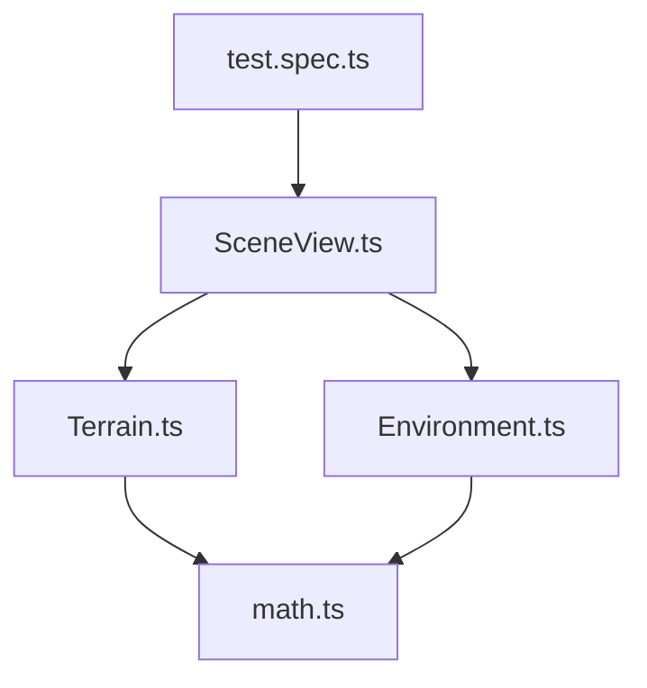
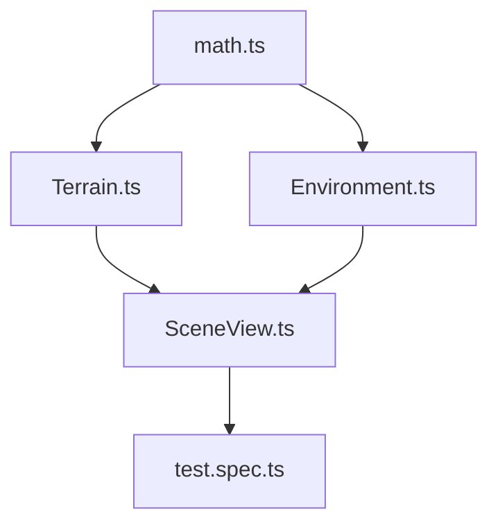
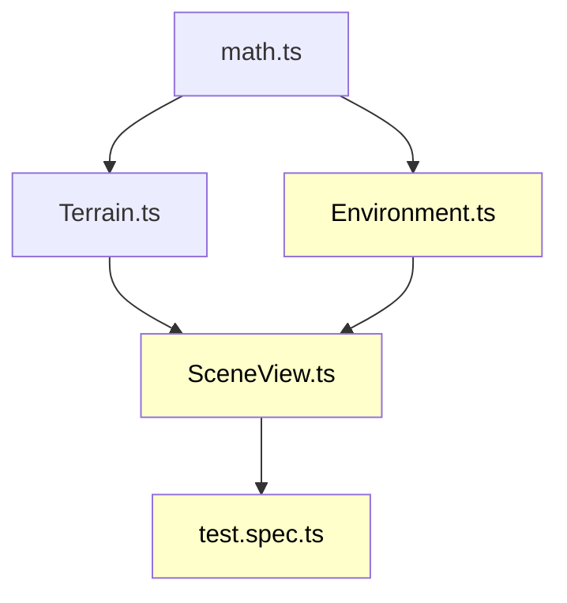
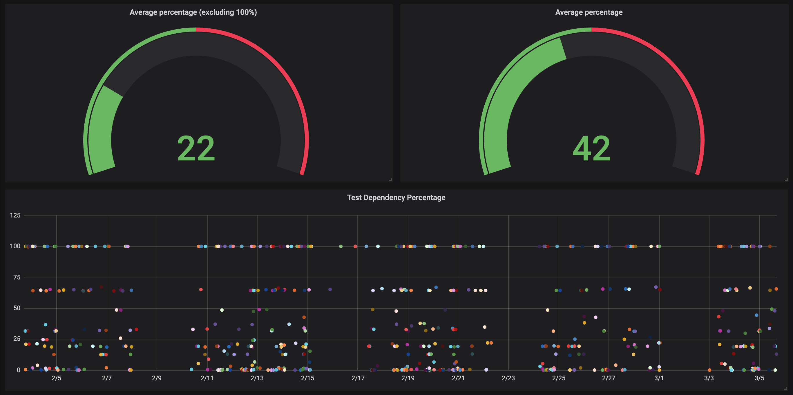

# From Jenkins to <br/>GitHub Actions

---

# JS SDK code base insights

- 4.x is now ~10 years in development
  - Forked from the 3.x codebase (so history is long)
- Today around ~90 individual contributors (~25 core devs) spread globally
- ~1M SLOC
- ... and growing

---

# Automated testing

- With a growing team and code base, automated testing becomes essential
  - Development productivity
  - Confidence in development impact
- Some stats from the JS SDK:
  - ~80 test related CI jobs a day (jobs take between 10 and 20 minutes)
  - With peaks of up to _150_ jobs day.
  - 20 to 40 hours of compute a day

---

# Automated testing

<LineChart csvPath="./data/loc-history.csv" />

---

# Original automation system

- Based on Jenkins (from 1, to 2, to blue ocean)
- Browser based testing using selenium
- Intern testing framework (from SitePen)
- Running in a data closet from the R&D in Zurich

---

# Key issues

- System became hard to understand (1 person bottleneck)
- Hard to maintain and evolve (lack of ownership)
- Hard to scale
- Hard to use (team should enjoy and embrace automation)
- Loss of trust in the system (instabilities, not transparent)

<div class="flex gap-4 mt-8">
  <div class="grow-0"></div>
  <div class="grow-1 self-center text-2xl italic">“Make everything as simple as possible, but not simpler”</div>
</div>

---

# Main decision: Jenkins or GitHub Actions

- Many small net negatives with Jenkins (documentation, maintenance, local testing, expertise, UI/UX)
- While with GitHub Actions
  - One less component to operate (scheduler)
  - Directly integrated with GitHub UI
  - Very well documented
  - Simple to get started
  - Backed by professional support

---

# Architecture design

<a target="_blank" href="../images/ci-architecture-diagram.png">
  <div class="flex justify-center">
    
  </div>
</a>

---

# Pipeline design



---

# Implementation

- ~2 people for 1 year
- Zero downtime migration
  - Decoupling testing code from framework
  - Decoupling application from SDK testing
  - Factoring shared functionality into reusable libraries (e.g. service mocks)
  - Setup self-hosted runner infrastructure
  - Migrate workflows

---

# Actual GitHub Actions pipeline today



---

# Scaling

- Hardly remove any features/tests, test set grows with code base
- How to scale
  - Reduce test run time (e.g. improve performance)
  - Add more compute resources
  - Run less tests?

---

# Scaling, dependency tracing

1. Create a dependency graph with test files being roots, resolving imports

<div class="flex justify-center mt-4">

</div>

---

# Scaling, dependency tracing

2. Reverse dependency graph

<div class="flex justify-center mt-4">

</div>

---

# Scaling, dependency tracing

3. List changed files in PR and trace graph to find affected tests

<div class="flex justify-center mt-4">



</div>

---

# Scaling, dependency tracing

- Main issue: dependency graph of JS SDK is too connected
  - Automatic loading of most of the functionality (e.g. webmap/webscene)
  - Autocasting
  - Dynamic imports have conditions not known statically
- Solution: rules for import dependent dynamic imports

```
    "esri/views/3d/layers/MapImageLayerView3D.ts": [
      [
        "esri/views/SceneView.ts",
        "esri/layers/MapImageLayer.ts"
      ]
    ],
    "esri/views/3d/layers/MediaLayerView3D.ts": [
      [
        "esri/views/SceneView.ts",
        "esri/layers/MediaLayer.ts"
      ]
    ],
```

---

# Scaling, dependency tracing



---

# Key takeaways

- GitHub Actions was a large net positive for the team
  - A lot more automation with less expertise needed
- Great and simple tooling make are great motivators
- Automated testing is an absolute necessity (also at smaller scales)
- Plan for scaling your test automation
- Automated tests are only as good as far as you can trust them
  - Absolutely essential that tests are stable and reliable
