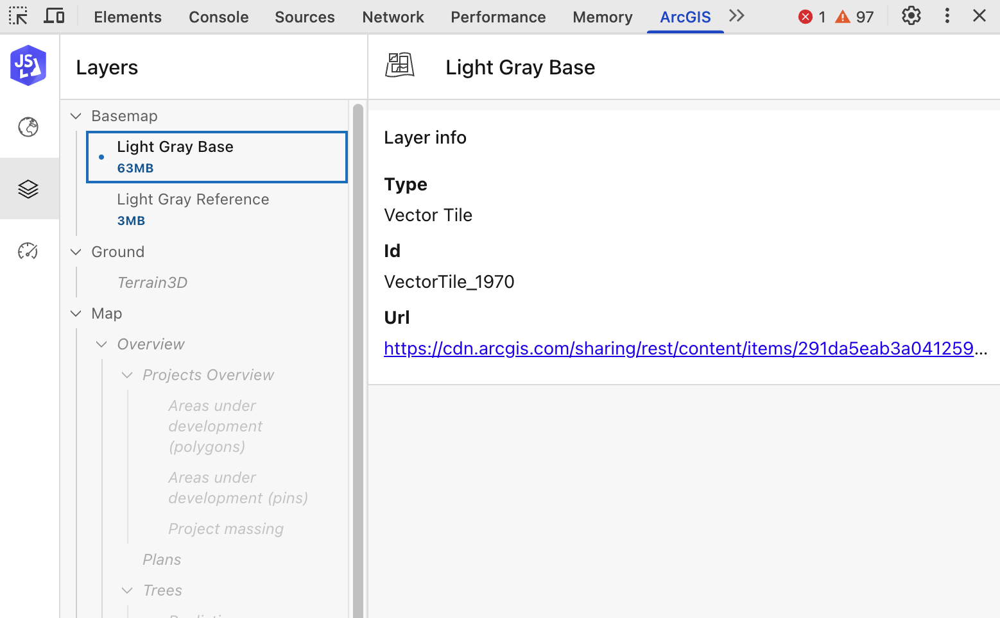

# Performance  insights in 3D

---

# 3D performance

- In 3D often have a lot of data in view at different scales
- 3D has high expectations (e.g. comparison to game engines)
  - Shadows, ambient occlusion, physically based lighting
  - Transparency
  - Environment "effects" (water, weather, clouds)
  - High level of detail (photo realistic 3D imagery)
- 3D typically has higher memory demands

---

# What do we care about?

The main things we care about

- Memory usage (too much memory means app crashes, especially on mobile/iOS)
- Interactive frame rates

...are also the things the browser doesn't inform you about 🤷‍♂️

- No memory information (neither available or used)
- No information on animation frame budget
- No information about GPU performance

---

# What do our users care about?

- Some things are universal
  - Never crash (out of memory)
- Others depend on audience
  - High quality visuals?
  - Highly interactive frame rates?

---

# Solution?

Lots of heuristics

- Estimate memory usage and reduce details when reaching limits
  - Memory limits are conservative, platform/form factor dependent
- Predict render frame times and GPU stalls to avoid frame stutters
- Schedule more work when the scene is "idle", less when interacting
- Adaptive render quality (high quality when "idle") by default, but user settable

---

# Demo

Quick tour of some of the tools we use to analyze performance of a scene

  

---

# Key takeaways

- Optimizing a 3D scene starts with optimizing your data
  - Reduce unnecessarily dense geometry
  - Reduce texture sizes
  - Make sure geometries have good level of detail
- Understand your target audience
  - Visual fidelity vs interactivity
